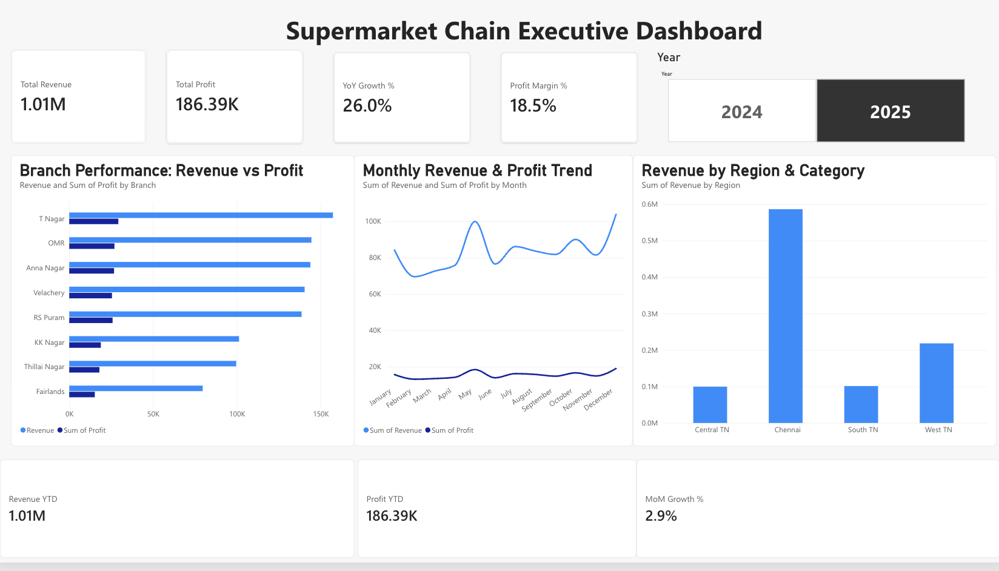

# Supermarket Chain Executive Dashboard

## Project Overview

This project presents a CEO-level **Supermarket Chain Executive Dashboard** developed using Microsoft Power BI.

The dashboard provides senior management with a consolidated view of supermarket performance across multiple branches. It focuses on key business metrics such as **Revenue, Profit, Growth %, Profit Margin %, Branch Performance, Monthly Trends, and Product Category Performance**.

The dataset used in this project is a synthetic supermarket sales dataset created for academic and analytical purposes.

---

## Dashboard Preview



---

## Business Objective

The objective of this project is to create an interactive executive dashboard that enables supermarket management to:

- Monitor overall revenue and profit
- Measure year-over-year growth
- Track profit margin
- Compare performance across branches
- Analyze monthly revenue and profit trends
- Identify high-performing product categories
- Filter business performance by year
- Support data-driven executive decision-making

---

## Key Performance Indicators

The dashboard contains four major executive KPIs:

| KPI | Result |
|---|---:|
| Total Revenue | 1.80M |
| Total Profit | 333.26K |
| Revenue Growth | 26.0% |
| Profit Margin | 18.5% |

> Revenue and profit values are displayed in compact format and represent INR-based sales data.

---

## Dashboard Features

### Branch Performance
Compares **Revenue and Profit across supermarket branches**, helping management identify stronger and weaker branch performance.

### Monthly Revenue & Profit Trend
Displays monthly business performance across **2024 and 2025**, allowing executives to monitor changes over time.

### Revenue by Product Category
Analyzes revenue contribution across different supermarket product categories.

### Year Filter
An interactive slicer allows users to switch between **2024 and 2025** and dynamically update the complete dashboard.

---
## DAX Measures

### Revenue Growth %

```DAX
Growth % =
VAR CurrentYear = MAX(SalesTable[Year])
VAR CurrentRevenue =
    CALCULATE(
        SUM(SalesTable[Revenue]),
        SalesTable[Year] = CurrentYear
    )
VAR PreviousRevenue =
    CALCULATE(
        SUM(SalesTable[Revenue]),
        FILTER(
            ALL(SalesTable[Year]),
            SalesTable[Year] = CurrentYear - 1
        )
    )
RETURN
    DIVIDE(
        CurrentRevenue - PreviousRevenue,
        PreviousRevenue,
        0
    )
```

### Profit Margin %

```DAX
Profit Margin % =
DIVIDE(
    SUM(SalesTable[Profit]),
    SUM(SalesTable[Revenue]),
    0
)
```

---

## Dataset

The dataset contains supermarket transaction data for **2024 and 2025**.

Key fields include:

- Transaction ID
- Date
- Year
- Month
- Branch ID
- Branch Name
- City
- Region
- Product Category
- Product Name
- Quantity
- Unit Price
- Discount %
- Revenue
- Cost
- Profit
- Payment Mode
- Customer Type

The project dataset contains approximately **6,200 transaction records**.

[Download the dataset](supermarket_sales_data.xlsx)

---

## Tools & Technologies

- Microsoft Power BI
- Power Query
- DAX
- Microsoft Excel
- GitHub
- Power BI Service

---

## Key Business Insights

- Revenue increased from 2024 to 2025, resulting in approximately **26% growth**.
- The supermarket chain generated approximately **1.80M in total revenue**.
- Total profit was approximately **333.26K**.
- The overall profit margin was approximately **18.5%**.
- Branch performance varies across locations, allowing management to identify stronger and weaker branches.
- Grocery contributes the largest share of product-category revenue in the project dataset.
- The monthly trend helps management identify changes in revenue and profitability over time.

---

## Conclusion

The Supermarket Chain Executive Dashboard demonstrates how Power BI can transform transactional supermarket data into meaningful executive-level insights.

By combining KPIs, branch comparisons, time-series analysis, category performance, and interactive filtering, the dashboard provides management with a simple and effective tool for monitoring business performance and supporting strategic decisions.
