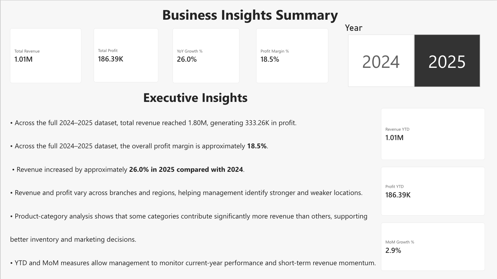

# Supermarket Chain Executive Dashboard

## Project Overview

This project presents a CEO-level **Supermarket Chain Executive Dashboard** developed using Microsoft Power BI.

The dashboard provides senior management with a consolidated view of supermarket performance across multiple branches. It focuses on key business metrics including **Revenue, Profit, Year-over-Year Growth, Profit Margin, YTD Performance, Month-over-Month Growth, Branch Performance, Regional Performance, Product Categories, and Monthly Trends**.

The project uses a synthetic supermarket sales dataset created for academic and analytical purposes, covering transactions from **2024 and 2025**.

---

## Dashboard Preview

### Executive Dashboard


### Business Insights Summary



---

## Business Objective

The objective of this project is to create an interactive executive dashboard that enables supermarket management to:

- Monitor overall revenue and profit
- Measure year-over-year revenue growth
- Track overall profit margin
- Monitor Revenue YTD and Profit YTD
- Measure month-over-month revenue growth
- Compare branch performance
- Analyze monthly revenue and profit trends
- Compare revenue across regions
- Drill down from Region to Product Category
- Filter business performance by year
- Present key findings through a dedicated Business Insights page
- Support data-driven executive decision-making

---

## Key Performance Indicators

Across the full **2024–2025 dataset**, the dashboard reports:

| KPI | Result |
|---|---:|
| Total Revenue | 1.80M |
| Total Profit | 333.26K |
| YoY Revenue Growth | 26.0% |
| Profit Margin | 18.5% |

> Revenue and profit values are displayed in compact format and represent INR-based sales data.

When **2025** is selected, the dashboard also displays approximately:

| Time Intelligence KPI | Result |
|---|---:|
| Revenue YTD | 1.01M |
| Profit YTD | 186.39K |
| MoM Growth | 2.9% |

These values update dynamically based on the selected year and reporting context.

---

## Dashboard Features

### Executive KPI Monitoring

The dashboard provides executive-level monitoring of:

- Total Revenue
- Total Profit
- YoY Growth %
- Profit Margin %

These KPIs give management an immediate overview of overall business performance.

### Branch Performance

The **Branch Performance: Revenue vs Profit** visual compares revenue and profit across supermarket branches, helping management identify stronger and weaker locations.

### Monthly Revenue & Profit Trend

The monthly trend visual tracks revenue and profit throughout the year, allowing management to identify changes in business performance over time.

### Revenue by Region & Category

Revenue can be analyzed using a drill-down hierarchy:

**Region → Product Category**

This allows users to first compare regional performance and then drill into individual product categories within a selected region.

### Time Intelligence

The dashboard includes time-intelligence measures for:

- Revenue YTD
- Profit YTD
- Month-over-Month Revenue Growth %
- Year-over-Year Revenue Growth %

These measures provide both current-year performance tracking and comparative trend analysis.

### Year Filter

An interactive Year slicer based on the DateTable allows users to switch between:

- 2024
- 2025

All relevant dashboard visuals and KPI measures respond dynamically to the selected year.

### Business Insights Summary

A dedicated **Business Insights** report page combines:

- Executive KPIs
- Year filtering
- Revenue YTD
- Profit YTD
- MoM Growth %
- YoY Growth %
- Management-level observations

This page provides senior management with a concise summary of the most important findings from the dashboard.

---

## Data Model

A dedicated DateTable was created to support reliable time-intelligence calculations.

```DAX
DateTable =
CALENDAR(
    MIN(SalesTable[Date]),
    MAX(SalesTable[Date])
)
```

A Year column was added to the DateTable:

```DAX
Year =
YEAR(DateTable[Date])
```

The model contains an active **one-to-many relationship**:

**DateTable[Date] (1) → SalesTable[Date] (*)**

with a single cross-filter direction.

This DateTable is used for YTD, MoM, YoY, and year-based filtering.

---

## DAX Measures

### Total Revenue

```DAX
Total Revenue =
SUM(SalesTable[Revenue])
```

### Total Profit

```DAX
Total Profit =
SUM(SalesTable[Profit])
```

### YoY Growth %

```DAX
YoY Growth % =
VAR CurrentYear =
    SELECTEDVALUE(
        DateTable[Year],
        MAXX(ALL(DateTable[Year]), DateTable[Year])
    )

VAR CurrentRevenue =
    CALCULATE(
        [Total Revenue],
        REMOVEFILTERS(DateTable),
        REMOVEFILTERS(SalesTable[Year]),
        DateTable[Year] = CurrentYear
    )

VAR PreviousRevenue =
    CALCULATE(
        [Total Revenue],
        REMOVEFILTERS(DateTable),
        REMOVEFILTERS(SalesTable[Year]),
        DateTable[Year] = CurrentYear - 1
    )

RETURN
    DIVIDE(
        CurrentRevenue - PreviousRevenue,
        PreviousRevenue,
        0
    )
```

### Profit Margin %

```DAX
Profit Margin % =
DIVIDE(
    SUM(SalesTable[Profit]),
    SUM(SalesTable[Revenue]),
    0
)
```

### Revenue YTD

```DAX
Revenue YTD =
TOTALYTD(
    [Total Revenue],
    DateTable[Date]
)
```

### Profit YTD

```DAX
Profit YTD =
TOTALYTD(
    [Total Profit],
    DateTable[Date]
)
```

### MoM Growth %

```DAX
MoM Growth % =
VAR PreviousMonthRevenue =
    CALCULATE(
        [Total Revenue],
        DATEADD(DateTable[Date], -1, MONTH)
    )
RETURN
    DIVIDE(
        [Total Revenue] - PreviousMonthRevenue,
        PreviousMonthRevenue,
        0
    )
```

---

## Dataset

The dataset contains supermarket transaction data for **2024 and 2025**.

Key fields include:

- Transaction ID
- Date
- Year
- Month
- Month Number
- Branch ID
- Branch Name
- City
- Region
- Product Category
- Product Name
- Quantity
- Unit Price
- Discount %
- Revenue
- Cost
- Profit
- Payment Mode
- Customer Type

The project dataset contains approximately **6,200 transaction records**.

[Download the dataset](supermarket_sales_data.xlsx)

---

## Tools & Technologies

- Microsoft Power BI
- Power BI Service
- Power Query
- DAX
- Microsoft Excel
- GitHub

---

## Key Business Insights

- Across the full 2024–2025 dataset, the supermarket chain generated approximately **1.80M in total revenue** and **333.26K in total profit**.
- The overall profit margin across the dataset is approximately **18.5%**.
- Revenue increased by approximately **26.0% in 2025 compared with 2024**.
- Revenue and profit vary across branches and regions, helping management identify stronger and weaker locations.
- Product-category contribution varies considerably, supporting more focused inventory and marketing decisions.
- Monthly revenue and profit trends help management identify changes in performance throughout the year.
- Revenue YTD and Profit YTD provide a view of accumulated current-year performance.
- MoM Growth % provides visibility into short-term revenue momentum.
- Region-to-Category drill-down enables more detailed investigation of regional sales performance.

---

## Project Structure

```text
Supermarket_Chain_Executive_Dashboard
│
├── README.md
├── supermarket_sales_data.xlsx
├── executive_dashboard.png
└── business_insights.png
```

---

## Conclusion

The **Supermarket Chain Executive Dashboard** demonstrates how Microsoft Power BI can transform transactional supermarket data into practical executive-level insights.

By combining executive KPIs, branch comparisons, monthly trend analysis, regional and category drill-down, Year-to-Date measures, Month-over-Month growth, Year-over-Year growth, interactive year filtering, and a dedicated Business Insights page, the dashboard provides management with a structured view of business performance and supports data-driven decision-making.
